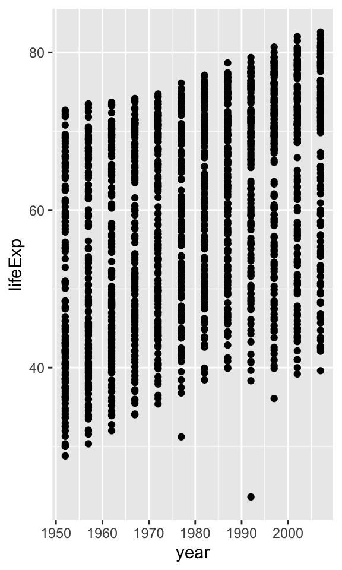

*This is some formatting*

**Some other formatting**

[A hyperlink](https://google.com)

- A bulleted list
- Another list item

1. A numbered list
1. A second numbered item.
   1. sub-item
       1. sub-sub item


```
## ── Attaching packages ─────────────── tidyverse 1.2.1 ──
```

```
## ✔ tibble  2.1.1     ✔ purrr   0.3.2
## ✔ tidyr   0.8.3     ✔ dplyr   0.8.1
## ✔ readr   1.3.1     ✔ stringr 1.4.0
## ✔ tibble  2.1.1     ✔ forcats 0.4.0
```

```
## ── Conflicts ────────────────── tidyverse_conflicts() ──
## ✖ dplyr::filter() masks stats::filter()
## ✖ dplyr::lag()    masks stats::lag()
```

```
## # A tibble: 6 x 6
##   country     continent  year lifeExp      pop gdpPercap
##   <fct>       <fct>     <int>   <dbl>    <int>     <dbl>
## 1 Afghanistan Asia       1952    28.8  8425333      779.
## 2 Afghanistan Asia       1957    30.3  9240934      821.
## 3 Afghanistan Asia       1962    32.0 10267083      853.
## 4 Afghanistan Asia       1967    34.0 11537966      836.
## 5 Afghanistan Asia       1972    36.1 13079460      740.
## 6 Afghanistan Asia       1977    38.4 14880372      786.
```

<!-- -->

<!-- -->

The largest population of any country in this dataset is 1318683096.


The maximum life expectancy in Iceland is 81.757.


The lowest GDP/capita of any country in 1977 was 371 and the highest GDP/capita of any country in 1977 was 5.9265477\times 10^{4}.


```
git config --global user.name "Jane Doe"
git config --global user.email "jane@example.com"
git config --global core.editor 'nano'
git init
```

Here is some more text that I am adding.

